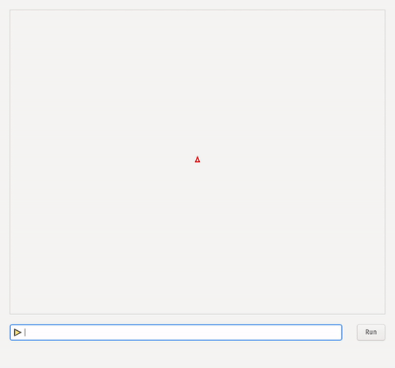

# Turtle

Turtle is a simple implementation of LOGO.

Take a walk down the memory lane ...

## Demo



## Installing

### Dependencies

Turtle requires the following to be built:
- CMake (>= 3.10)
- make  
- gcc
- gtkmm-3.0
- Boost (>= 1.70)

On Ubuntu, the following command will install them:
```shell
sudo apt install git cmake make gcc libgtkmm-3.0-dev libboost-all-dev
```

### Steps to build

Clone this repo and run the `build.sh` script.
```shell
git clone https://github.com/RedDocMD/turtle
cd turtle
./build.sh
```
Note that `build.sh` requires `sudo` to copy the binary and desktop files
to their correct destinations.

## Features

### Commands

| Command | Parameter | Action |
| ------- | --------- | ------ |
| FD | distance (integer) | Move turtle forward |
| BK | distance (integer) | Move turtle backward |
| RT | angle (integer, degrees) | Turn turtle clockwise |
| LT | angle (integer, degrees) | Turn turtle anti-clockwise |
| REPEAT | Explained below | Repeat a set of statements
| CLS | - | Clear screen |
| PEN | UP/DOWN | Draw lines/Don't draw lines |

#### REPEAT command
Syntax: `REPEAT <count> (<command> [,<command>]*)`

### Others

- Hitting Return is same as pressing the run button
- Pressing Up/Down arrow moves one through the **command history**

### License
Copyright (c) 2021 Deep Majumder

Turtle is made available under the GNU General Public License v2.0

You can view the license [here](https://github.com/RedDocMD/turtle/blob/main/LICENSE)